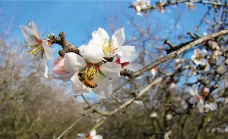

I am a PhD student in the Bioinformatics and Computational Biology program. 
I am co-advised by [Paul Hohenlohe](https://www.uidaho.edu/sci/biology/people/faculty/hohenlohe){:target="_blank"} in the
[Hohenlohe lab](http://hohenlohelab.github.io/){:target="_blank"} and [Erkan Buzbas](https://www.uidaho.edu/sci/stat/people/faculty/erkanb){:target="_blank"}. I work on Approximate Bayesian Computation (ABC) methods to study divergent selection in yeast. 

#### Previous Projects ####

